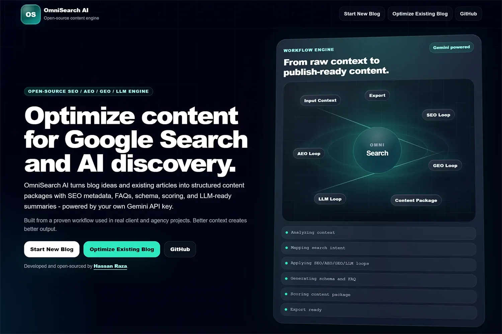
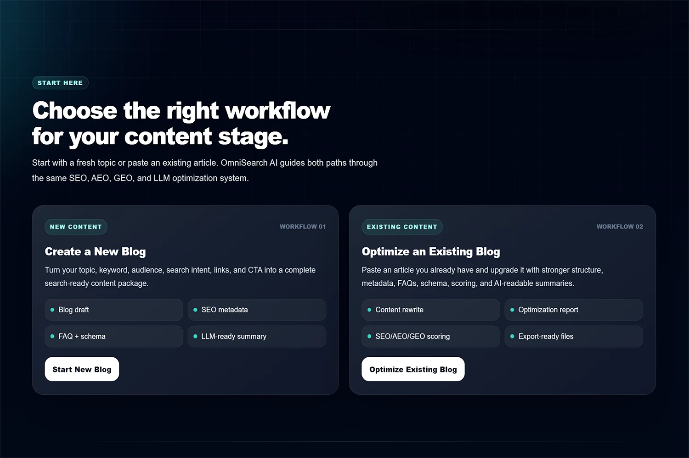
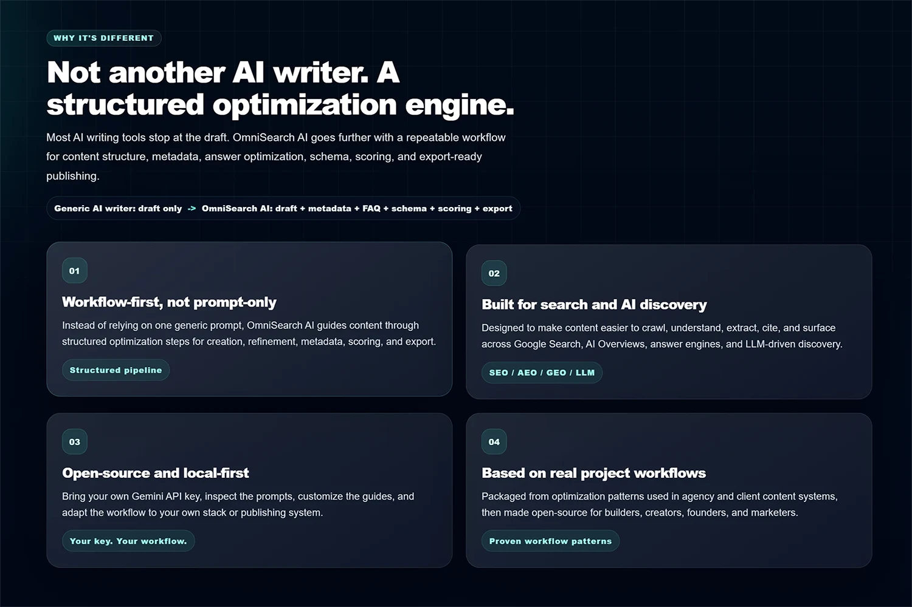
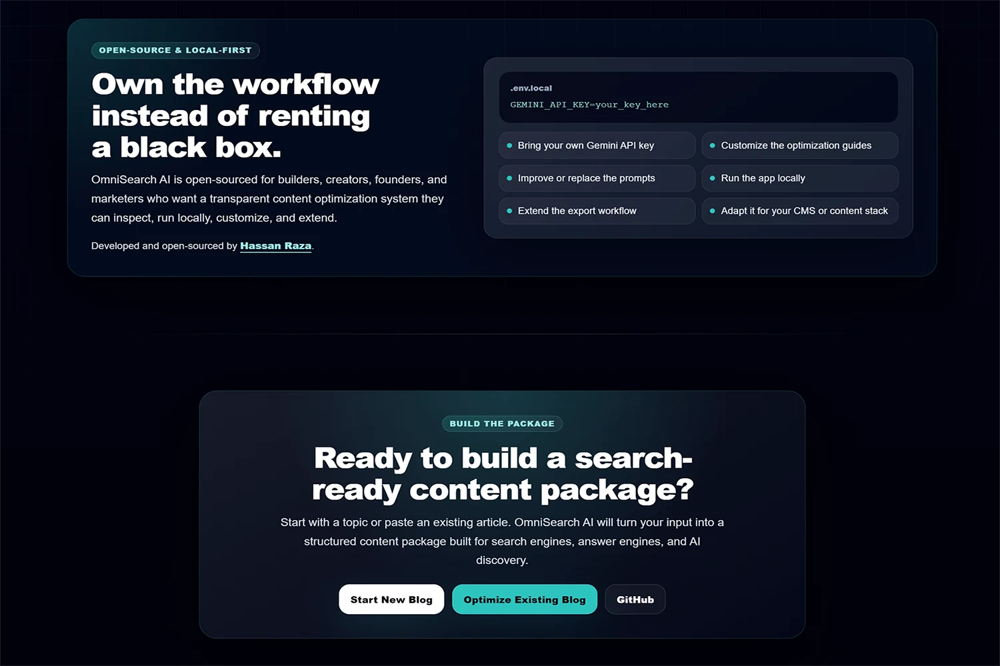

# OmniSearch AI

<div align="center">

**The open-source engine for SEO, AEO, GEO, and LLM content optimization.**

Generate or upgrade blog posts that rank on Google, appear in AI Overviews,
get cited by ChatGPT and Perplexity, and surface in LLM-powered search —
all powered by your own Gemini API key.

[](LICENSE)
[](https://nextjs.org)
[](https://typescriptlang.org)
[](https://ai.google.dev)
[](CONTRIBUTING.md)

[**Try it in 60 seconds**](#quick-start) ·
[Report a Bug](https://github.com/hassanrrraza/omnisearch-ai/issues/new?template=bug_report.md) ·
[Request a Feature](https://github.com/hassanrrraza/omnisearch-ai/issues/new?template=feature_request.md)

<br>



</div>

---

## Table of Contents

- [Why OmniSearch AI?](#why-omnisearch-ai)
- [Features](#features)
- [Quick Start](#quick-start)
- [Command-Line Interface](#command-line-interface)
- [How It Works](#how-it-works)
- [Customize the Optimization Engine](#customize-the-optimization-engine)
- [Project Structure](#project-structure)
- [Tech Stack](#tech-stack)
- [Contributing](#contributing)
- [Maintainer](#maintainer)
- [License](#license)

---

## Why OmniSearch AI?

Most AI writing tools generate content. OmniSearch AI optimizes it across four
distinct discovery channels that most creators ignore:

| Channel | What it means | OmniSearch AI output |
| :------ | :------------ | :------------------- |
| **SEO** | Rank on Google | Title tag, meta, slug, keyword placement, schema |
| **AEO** | Appear in AI Overviews & answer boxes | Featured snippet, FAQPage schema, PAA-ready FAQ |
| **GEO** | Get cited by ChatGPT, Perplexity, Claude | Factual density, comparison tables, LLM summary |
| **LLM** | Surface in AI-powered search | Semantic structure, extractable facts, Q&A format |

> **There is no other open-source tool that handles all four together.**

### Product Screenshots

| | | | |
| :---: | :---: | :---: | :---: |
|  |  |  |  |

---

## Features

### ✦ Create New Blog

- Generate a complete blog post up to 2,500 words from a title + keyword
- SEO title, meta description, and URL slug auto-generated
- Featured snippet answer block (40–60 words, Google-extractable)
- 3-question FAQ section from real PAA (People Also Ask) patterns
- FAQPage + BreadcrumbList JSON-LD schema ready to paste into your site
- LLM Summary for AI system comprehension and citation
- Optimization score across SEO / AEO / GEO / LLM (0–100 each)

### ✦ Optimize Existing Blog

- Paste any existing article and get a fully upgraded version back
- Preserves your voice and core content
- Detailed change log: what changed, where, and why
- Before/after improvement report per optimization category
- Same full output bundle: metadata, FAQ, schema, LLM summary, scores

### ✦ Export Everything

- Copy Markdown to clipboard
- Download as `.md`
- Download as `.html` (styled, ready to preview in browser)
- Copy all metadata as JSON

---

## Quick Start

### Requirements

- [Node.js](https://nodejs.org/en/download/) (version 18 or higher). Check your version with `node -v`.
- A free [Gemini API key](https://aistudio.google.com/app/apikey). Follow the instructions on the Google AI Studio page to generate your API key.

### Setup Steps

**1. Clone the repository**

```bash
git clone https://github.com/hassanrrraza/omnisearch-ai
cd omnisearch-ai
```

**2. Install dependencies**

```bash
npm install
```

**3. Configure your Gemini API key**

Copy the example environment file, then open `.env.local` to add your Gemini API key:

```bash
cp .env.example .env.local
```

Edit `.env.local`:

```env
GEMINI_API_KEY=your_gemini_api_key_here
```

Replace `your_gemini_api_key_here` with the API key you obtained from Google AI Studio.

**4. Start the application**

```bash
npm run dev
```

The application will be accessible at [http://localhost:3000](http://localhost:3000).

---

## Command-Line Interface

OmniSearch AI provides command-line interface (CLI) tools for generating and optimizing content directly from your terminal.

### Generate New Blog Post

To generate a new blog post using a JSON input file:

```bash
npm run generate <path-to-your-input.json>
```

**Example input file** (`new-blog.example.json`):

```json
{
  "title": "Your Blog Post Title",
  "keyword": "your primary keyword",
  "wordCount": 1500
}
```

### Optimize Existing Blog Post

To optimize an existing blog post from a Markdown file:

```bash
npm run optimize:file <path-to-your-existing-blog.md> <path-to-your-config.json>
```

**Example config file** (`optimize-config.example.json`):

```json
{
  "focusKeywords": ["keyword1", "keyword2"],
  "targetAudience": "developers",
  "toneOfVoice": "informative"
}
```

### File Mode (No Browser Required)

Drop a JSON file in `/input`, run one command, and get your full output in `/output`.

**Setup:**

```bash
cp input/new-blog.example.json input/new-blog.json
# Edit new-blog.json with your blog details
```

**Generate:**

```bash
npm run generate
```

**Output files written to `/output`:**

```text
output/
your-slug.md                  ← The blog post
your-slug.json                ← Full output bundle
your-slug-metadata.json       ← SEO metadata
your-slug-schema.json         ← FAQPage JSON-LD
```

**Terminal output includes scores:**

```text
--- Optimization Scores ---
SEO:     88/100
AEO:     91/100
GEO:     85/100
LLM:     89/100
Overall: 88/100
```

**Optimize an existing blog:**

```bash
cp input/existing-blog.example.md input/existing-blog.md
# Paste your blog content into existing-blog.md
cp input/optimize-config.example.json input/optimize-config.json
# Fill in keyword, audience, goal
npm run optimize:file
```

### CLI Mode

```bash
# From inside the project directory:
npx omnisearch-ai new
npx omnisearch-ai optimize

# Or use the npm scripts directly:
npm run generate
npm run optimize:file
```

---

## How It Works

OmniSearch AI injects three optimization guides as system context into every
Gemini prompt. The guides encode rules for SEO, AEO, and GEO. Gemini applies
them to generate or improve your content.

```text
User Input
    ↓
Form Validation (Zod)
    ↓
Load SEO + AEO + GEO Guides from lib/guides/
    ↓
Build Prompt (lib/prompts/)
    ↓
Call Gemini API (server-side only — key never exposed)
    ↓
Validate JSON Response (Zod)
    ↓
Render: Blog · Metadata · FAQ · Schema · LLM Summary · Score
    ↓
Export: .md · .html · clipboard
```

**Your API key never leaves your machine.** All Gemini calls go through the
Next.js API route. The key is only read server-side from `.env.local`.

---

## Customize the Optimization Engine

The three `.md` files in `lib/guides/` are the knowledge base:

```text
lib/guides/
seo-optimization-guide.md   ← SEO rules, keyword strategy, E-E-A-T signals
aeo-optimization-guide.md   ← Answer engine rules, FAQPage, featured snippets
geo-optimization-guide.md   ← GEO rules, factual density, LLM citation signals
```

**Replace these files with your own guides** and the engine uses them instead.
This makes OmniSearch AI fully adaptable to any niche, brand voice, or
optimization methodology.

---

## Project Structure

### Directory Overview

Here's an overview of the key directories and files in the project:

| Path | Description |
| :--- | :---------- |
| `app/` | Next.js application pages and API routes |
| `app/api/` | API routes for content generation and optimization |
| `app/new-blog/` | Page for creating new blog posts |
| `app/optimize-blog/` | Page for optimizing existing blog posts |
| `cli/` | Command-line interface tools (`index.js`, `index.ts` entry points) |
| `components/` | React components used throughout the application |
| `input/` | Example input files for generation and optimization |
| `lib/` | Core logic and utilities |
| `lib/gemini.ts` | Gemini API integration |
| `lib/file-mode/` | Logic for file-based generation and optimization |
| `lib/guides/` | Optimization guides used as system context for Gemini |
| `lib/prompts/` | Gemini prompt definitions |
| `lib/schemas/` | Zod schemas for input and output validation |
| `lib/utils/` | General utility functions |
| `output/` | Directory for output files (e.g., generated blogs) |
| `public/` | Static assets |
| `scripts/` | Utility scripts |

### Detailed Layout

```text
omnisearch-ai/
├── app/
│   ├── page.tsx                    # Homepage
│   ├── new-blog/page.tsx           # Create blog flow
│   ├── optimize-blog/page.tsx      # Optimize blog flow
│   └── api/
│       ├── generate-blog/route.ts  # POST /api/generate-blog
│       └── optimize-blog/route.ts  # POST /api/optimize-blog
├── components/
│   ├── BlogForm.tsx                # New blog form
│   ├── ExistingBlogForm.tsx        # Optimize blog form
│   ├── OutputPreview.tsx           # New blog output panel
│   ├── OptimizeOutputPreview.tsx   # Optimize output panel
│   ├── PreviewActions.tsx          # Score cards + export buttons
│   └── SerpPreview.tsx             # Google SERP preview
├── lib/
│   ├── gemini.ts                   # Gemini client
│   ├── guides/                     # SEO · AEO · GEO knowledge base
│   ├── prompts/                    # Prompt builder functions
│   ├── schemas/                    # Zod input/output schemas
│   └── utils/download.ts           # Export helpers
├── input/                          # Example input files
├── .env.example                    # Environment variable template
└── README.md
```

---

## Tech Stack

| Layer | Technology |
| :---- | :--------- |
| Framework | Next.js 16 (App Router) |
| Language | TypeScript (strict mode) |
| Styling | Tailwind CSS |
| AI Engine | Google Gemini 2.0 Flash |
| Validation | Zod |
| Forms | React Hook Form |
| Markdown | react-markdown |

---

## Contributing

Contributions are welcome. Please read [CONTRIBUTING.md](CONTRIBUTING.md) first.

**Good first issues:** look for the
[`good first issue`](https://github.com/hassanrrraza/omnisearch-ai/issues?q=label%3A%22good+first+issue%22)
label.

---

## Maintainer

Built and maintained by [Hassan Raza](https://github.com/hassanrrraza).

Website: [https://hassanr.com/](https://hassanr.com/)

---

## License

MIT © [Hassan Raza](https://github.com/hassanrrraza)

---

<div align="center">
  <sub>If OmniSearch AI helped you, please ⭐ star the repo.</sub>
</div>
